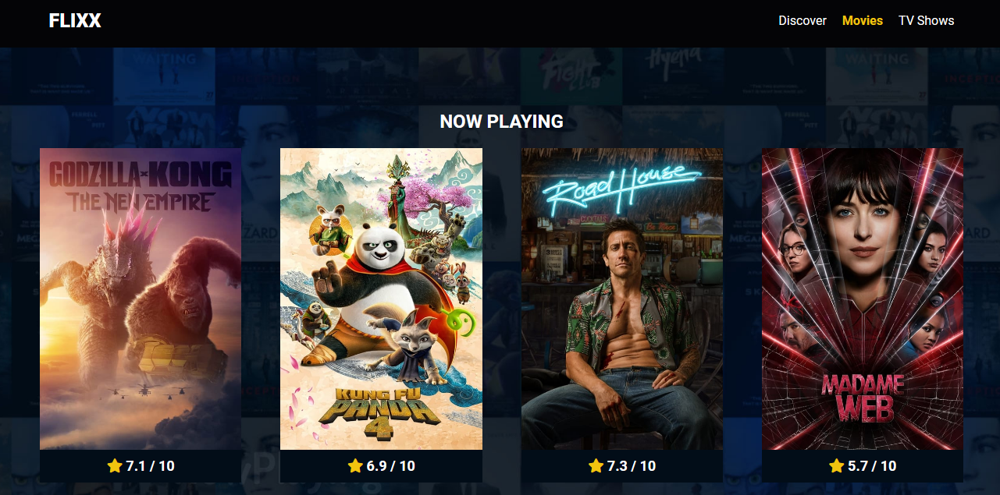

# Flixx Movie App

Flixx is a full-stack movie application built using Vanilla JS. It fetches data from the TMDB API, one of the best APIs for creating movie applications like Netflix, providing users with a platform to explore trending, upcoming, and popular movies and TV shows. The application includes search functionality with radio buttons for filtering by movie or TV show. Additionally, users can navigate to detailed pages for each movie or TV show, which display information about the title along with the top cast members and their TMBD profiles.

## Application Interface

## Features

- **Search**: Search functionality with filters for movies and TV shows.
- **Trending**: Slider displaying trending movies and TV shows.
- **Upcoming**: Section showcasing upcoming movies and TV shows.
- **Now Playing and Popular**: Pages dedicated to displaying now playing and popular movies and TV shows.
- **Details**: Detailed pages for each movie or TV show, including information about the Movie or TV Show overview, genres, rating, budget, revenue and top cast members with links to their TMBD profiles.

## Setup

To run this project locally, follow these steps:

1. Clone the repository: `git clone https://github.com/Umairulislam/Flixx-Movie-App.git`
2. Navigate into the directory: `cd Flixx-Movie-App`
3. Open with live server

## Environment Variables

This project uses the following environment variables:

- `API_URL`: The base URL for the TMDB API. This should be set to `https://api.themoviedb.org/3/`.
- `API_KEY`: Your TMDB API key.

## Deployment

This project is deployed on Netlify. You can view the live site [here](https://your-netlify-site.netlify.app).

## Contributing

Contributions are welcome! Please open an issue or submit a pull request.

## License

This project is licensed under the MIT License.
